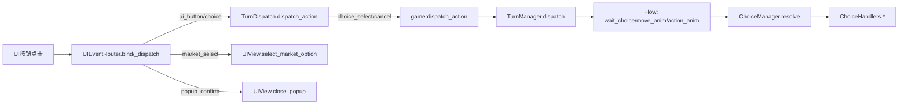
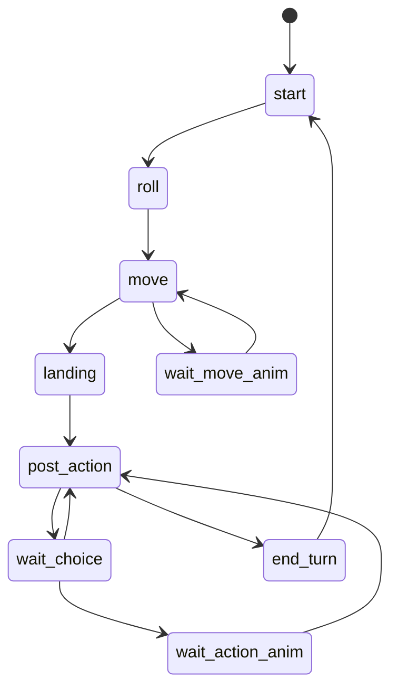

# UI 事件到回合链路审查（Uncle Bob 视角）

摘要：
UI 到回合的关键链路整体可运行，但职责边界混杂、依赖方向倒置明显，导致可维护性下降与交互崩溃风险。最大风险是道具槽在非道具阶段触发断言崩溃，以及 UI 重载后监听失效。

调用流与状态流：

主要问题（P0-P3）：
- P1：道具槽点击在非道具阶段会触发断言崩溃。UI 永久注册道具槽点击，而 TurnDispatch 对 item_slot_* 要求 pending_choice.kind == item_phase_choice。
- P1：UI 事件注册缺少生命周期管理，UI 重载或节点重建后可能无法响应，Listener 未被保存与销毁。
- P2：输入阻断规则在 UIEventRouter 与 TurnDispatch 双重实现，规则不一致，造成策略漂移。
- P2：UIEventRouter 同时承担节点查询、事件注册、意图映射与业务分发，违反 SRP，且直接依赖 UI 细节与游戏动作，违背 DIP。
- P2：UIEventHandlers.install 只允许一次安装，无法在新 state/logger 上刷新事件处理，影响热重载与测试。
- P3：UIModel 在模块加载时缓存 board_tiles，若地图配置变更，UI 可能不刷新。

重构方案：
- 统一输入门控规则到单一模块，UI 层只负责意图生成，游戏层只负责执行。
- 拆分 UIEventRouter 的职责为绑定、映射、派发三层。
- 增加监听句柄管理与解绑流程，支持 UI 重建。
- 对道具槽点击增加阶段约束，或根据阶段禁用 UI 按钮。
- 允许 UIEventHandlers 重复安装或提供 reset 以更新 logger/state。
- 视需求为 TurnDispatch 引入时间源注入以提升可测性。

测试建议：
- UI 点击到 dispatch_action 的映射覆盖按钮、选项、取消、市场确认。
- 非道具阶段点击道具槽不崩溃，道具阶段点击选择正确。
- input_blocked 为 true 时所有交互一致阻断，解除后恢复。
- UI 重建后按钮可响应，监听可解绑再绑定。
- pending_action 与 wait_* 状态下输入不会丢失或重复执行。

风险/权衡：
- 拆分与门控会增加模块与配置数量，短期复杂度上升。
- 统一规则可能改变边缘交互行为，需要回归测试。
- 监听解绑流程需要精确的 UI 生命周期时机。
