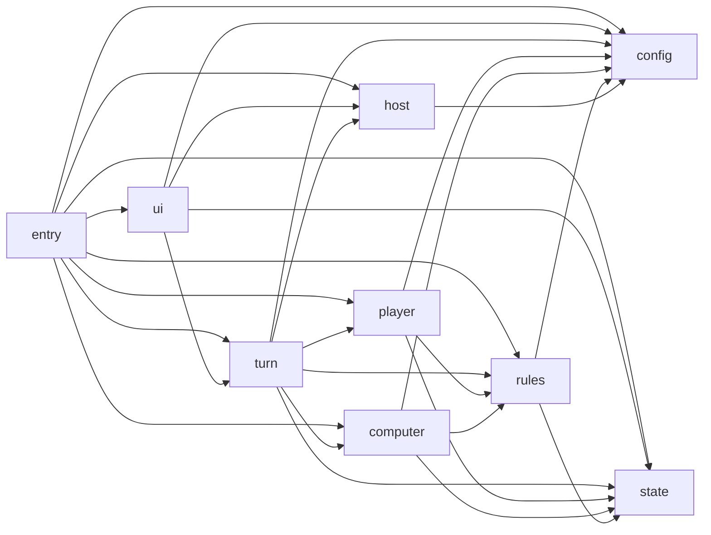

# Concept-First Top-Level Layout

## Summary

- 顶层不用 `domain` / `application` / `adapters` / `platform` 这类 Clean Architecture 教科书词汇，改成直接表达游戏运行链路的目录：`ui -> turn -> (player | computer) -> rules -> (state | config)`。
- 宿主与启动不混进主链，单独放在 `host` 和 `entry`；它们是支撑层，不是玩法主层。
- `runtime` 不再作为目录名；只允许出现在少数对象名里，表示“运行态状态”或“循环实例”。

## Target Tree

```text
src/
  entry/
    boot.lua
    start_game.lua
    start_ui.lua
    wire_host.lua

  host/
    eggy/
      context.lua
      event_bridge.lua
      scheduler.lua
      scene_ui.lua
      sound.lua
      raycast.lua
      ui_manager.lua
      units.lua

  ui/
    input/
    controllers/
    presenters/
    render/
    widgets/
    stores/
    schema/

  turn/
    loop/
    phases/
    actions/
    policies/
    output/
    timing/

  player/
    choices/
    actions/
    policies/

  computer/
    policies/
    planners/
    evaluators/
    selectors/

  rules/
    board/
    chance/
    commerce/
    effects/
    endgame/
    items/
    land/
    market/
    movement/
    vehicle/
    turn_rules/

  state/
    game_state.lua
    player_state.lua
    board_state.lua
    turn_state.lua
    ui_state.lua
    state_access/

  config/
    gameplay/
    ui/
    balance/
    content/
```

## Static Dependency Graph



## Dependency Rules

- `ui` 只负责输入映射、呈现和本地 UI 状态，不写玩法规则。
- `turn` 负责回合推进、阶段切换、动作分发、超时与等待；它可以编排 `player` / `computer` / `rules`，但不拥有具体规则实现。
- `player` 只放“人类玩家能做什么、怎么表达选择”，不放 UI 节点和宿主 API。
- `computer` 只放 AI 决策，不推进回合。
- `rules` 是共享玩法规则中心；市场、地块、道具、移动、胜负都放这里。
- `state` 只放运行态数据模型与访问器；不放业务决策。
- `config` 只放静态配置、数值和内容表；不放流程逻辑。
- `host` 只封装 Eggy 细节；不得承接玩法规则。
- `entry` 是唯一允许做装配、注册、默认实现选择的地方。

## Naming Rules

- 顶层目录只用玩法语义词：`ui`、`turn`、`player`、`computer`、`rules`、`state`、`config`、`host`、`entry`。
- 子目录优先业务名词或动作名：`market`、`resolve_landing`、`purchase`、`roll`、`selectors`。
- 禁用泛化总名：`runtime`、`core`、`common`、`misc`、`manager`、`service`。
- 运行态数据统一用 `*_state.lua` 或 `*_store.lua`。
- 循环/执行器统一用 `*_loop.lua`、`*_engine.lua`、`*_scheduler.lua`。

## Tests and Guards

- 护栏按上图做静态检查：禁止反向依赖，禁止任意模块循环。
- `rules/*` 必须可脱离 `host` 和 `ui` 单独测试。
- `turn/*` 必须可通过 fake `player` / `computer` / `host` 跑用例测试。
- `ui/*` 只测输入映射、presenter、render 和 store，不测玩法规则。
- `host/*` 只测 Eggy 集成 contract，不测业务语义。

## Assumptions and Defaults

- 目录命名目标是“让新人从目录名直接读出游戏结构”，而不是“让人看出用了哪套架构理论”。
- `rules` 是 `shared-mechanics` 的正式目录名；文档里可以继续把它解释成 shared mechanics。
- `entry` 和 `host` 不属于主玩法链，只是支撑层；架构图和文档里应单独标注。
