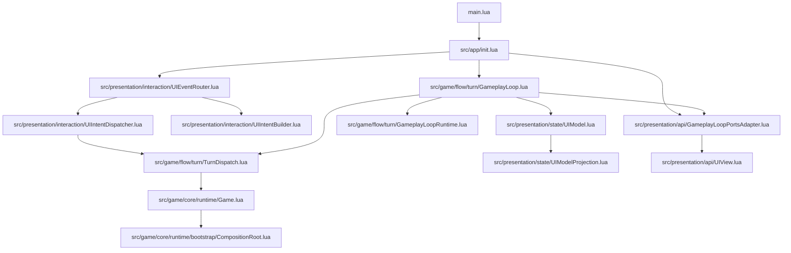
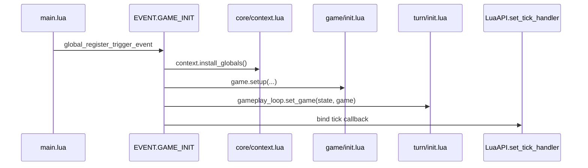
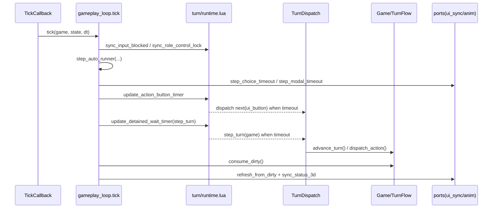

# Monopoly Lua 项目架构

## 概览

项目入口是 `main.lua`。初始化阶段完成三件事：
- 建立运行时上下文与环境绑定（`core/context.lua` + `core/env.lua`）。
- 组装游戏状态并注入回合循环（`game/init.lua` + `turn/init.lua`）。
- 绑定引擎生命周期事件（`EVENT.GAME_INIT`）并注册 tick 处理（`LuaAPI.set_tick_handler`）。

运行期采用“回合推进 + 脏标记刷新”模型：
- 领域状态推进：`game.advance_turn()` / `game.dispatch_action()`。
- 回合编排：`gameplay_loop.tick()`。
- 脏数据消费：`game:consume_dirty()`。

## 目录职责

- `main.lua`：唯一入口；注册 `GAME_INIT` 与 tick 处理，统一启动链路。
- `core/context.lua`：运行时上下文；安装环境绑定、全局 helper、编辑器导出。
- `core/env.lua`：将 `LuaAPI`/`GameAPI` 绑定到运行时所需全局函数。
- `game/init.lua`：领域门面；`setup/update/dispatch_action/advance_turn`。
- `game/bootstrap.lua`：组装 board/players/turn/dirty/registries。
- `turn/init.lua`：每帧调度中枢（`set_game/new_game/tick`）。
- `turn/runtime.lua`：输入锁、控制锁、超时计时等运行时细节。
- `turn/dispatch.lua`：UI action 校验与落地执行。
- `turn/ports.lua`：ports 分组接口与默认实现（`modal/anim/ui_sync/debug/state`）。

## 分层依赖（Mermaid）

说明：依赖方向是“应用编排层 -> 流程层 -> 领域层”，表现层通过 ports 被流程层调用，避免流程层直接依赖具体 UI 节点 API。

## 启动与 Tick 序列（Mermaid）

### 启动序列

### Tick 序列

## 核心领域对象

- `Game`（`src/game/core/runtime/Game.lua`）
  - 领域门面，控制回合推进与动作分发。
  - 生命周期由 `CompositionRoot.assemble` 完成实体装配。
- `GameVictory`（`src/game/core/runtime/policies/GameVictory.lua`）
  - 仅负责胜负计算与领域状态更新；通过 `MonopolyEvents.game.finished` 发出结算事件。
- `turn`（在 `CompositionRoot.lua` 初始化）
  - 持有回合态：`current_player_index`、`phase`、`pending_choice`、动画序列、计时字段等。
- `dirty`（`src/core/DirtyTracker.lua`，由 `CompositionRoot.lua` 接入）
  - 聚合状态变更标记，供 `GameplayLoop.tick` 驱动 UI 增量刷新。
- `pending_choice` / popup intent（`src/game/flow/intent/IntentDispatcher.lua`）
  - 领域向 UI 发起交互需求的统一结构。
- `UIModel`（`src/presentation/state/UIModel.lua`）
  - 面向渲染的只读快照，不直接承载领域行为。

## 扩展点

- UI 事件扩展：`src/presentation/interaction/UIEventRouter.lua`
  - 在 `_build_default_route_specs` 增加 route spec（节点名 + `build_intent`）。
- UI 触控策略扩展：`src/presentation/interaction/UITouchPolicy.lua`
  - 新增或调整“谁可点/谁不可点”规则时，优先修改该模块；`UIInputLockPolicy` 只做流程编排，不重复写触控细节。
- UI 动作语义扩展：`src/game/flow/turn/TurnDispatch.lua`
  - 新增 `action.type` 或 `ui_button.id` 分支，并走 validator。
- Tick 行为扩展：`src/game/flow/turn/GameplayLoop.lua` 与 `GameplayLoopRuntime.lua`
  - 编排逻辑放 `GameplayLoop`，计时/锁策略放 `GameplayLoopRuntime`。
- 表现能力替换：`src/presentation/api/GameplayLoopPortsAdapter.lua`
  - 可替换 ports 实现以适配不同 UI 运行时或测试桩；优先按分组子接口替换。
- 胜负表现扩展：`src/presentation/api/UIEventHandlers.lua`
  - 监听 `MonopolyEvents.game.finished` 并执行胜负面板展示，避免领域层直接依赖 UI 引擎细节。
- UI 投影扩展：`src/presentation/state/UIModelProjection.lua`
  - 新增投影函数，再由 `UIModel.build/update` 接入。

## 新人阅读路径

建议按“先主链路，再细节”的顺序：

1. `main.lua`：确认入口极简。
2. `src/app/init.lua`：看初始化装配、事件绑定、tick 启动。
3. `src/game/core/runtime/bootstrap/CompositionRoot.lua` 与 `src/game/core/runtime/Game.lua`：理解领域对象如何组装与推进。
4. `src/game/flow/turn/GameplayLoop.lua`：把握每帧做什么。
5. `src/game/flow/turn/GameplayLoopRuntime.lua` 与 `src/game/flow/turn/TurnDispatch.lua`：理解输入锁、超时、动作落地。
6. `src/presentation/interaction/UIEventRouter.lua`：理解 UI 点击如何变成 intent/action。
7. `src/presentation/interaction/UITouchPolicy.lua` 与 `src/presentation/interaction/UIInputLockPolicy.lua`：理解输入锁期间的触控放行/锁定边界。
8. `src/presentation/state/UIModel.lua` 与 `src/presentation/state/UIModelProjection.lua`：理解领域状态如何投影为 UI。
9. `src/presentation/api/GameplayLoopPortsAdapter.lua` 与 `src/presentation/api/UIView.lua`：理解渲染层与流程层的接口边界。

读完以上文件，基本可以独立定位：
- “按钮点击为什么没生效”（先看 `UIEventRouter.lua` -> `TurnDispatch.lua`）。
- “状态变了为什么 UI 没更新”（先看 dirty 标记 -> `GameplayLoop.tick` -> `UIModel.update`）。
- “某阶段为什么不能操作”（先看 `GameplayLoopRuntime.is_phase_input_blocked` 与锁策略）。
