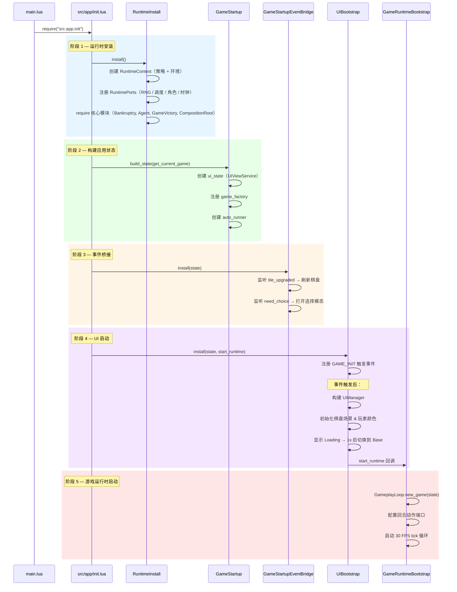
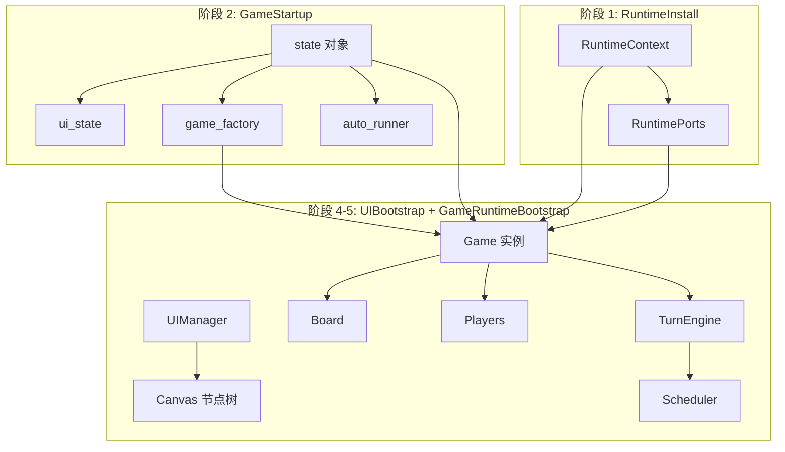

# 启动序列

## 目的

描述从 `main.lua` 到首帧 tick 的完整启动流程，帮助开发者理解模块何时被创建与连接。

## 五阶段启动时序图

## 对象生命周期

## 关键设计决策

**单元素数组引用传递**：`current_game_ref[1]` 模式允许 GameStartup 在创建 state 时尚未拥有 Game 实例，而在 GameRuntimeBootstrap 阶段回填引用。

**事件驱动延迟初始化**：UIBootstrap 注册 `GAME_INIT` 事件，UI 节点树就绪后才触发 GameRuntimeBootstrap，确保渲染管线在游戏逻辑之前完成初始化。
