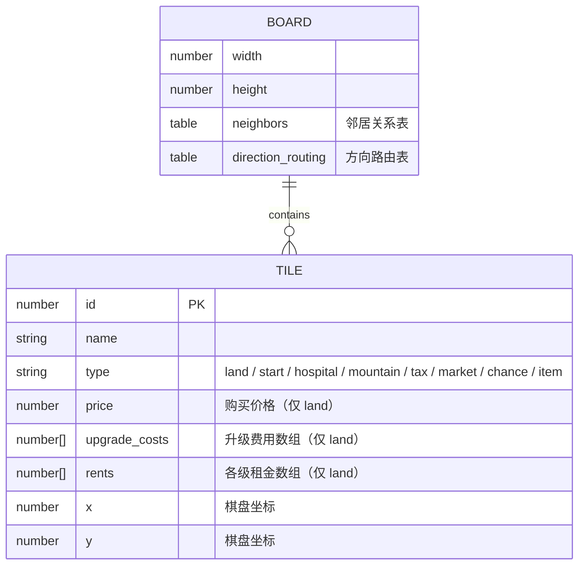
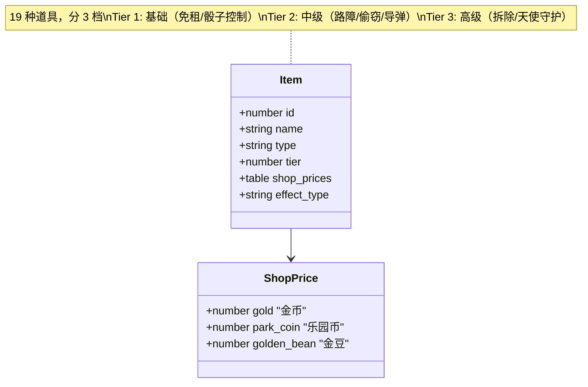
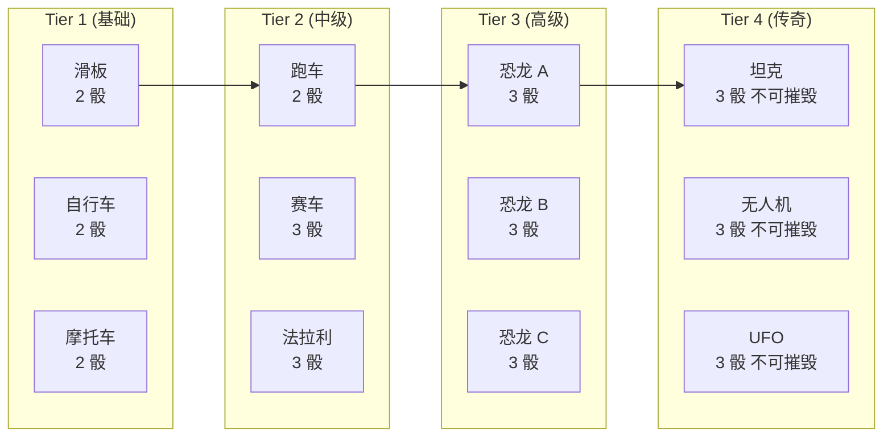
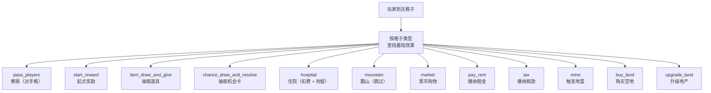
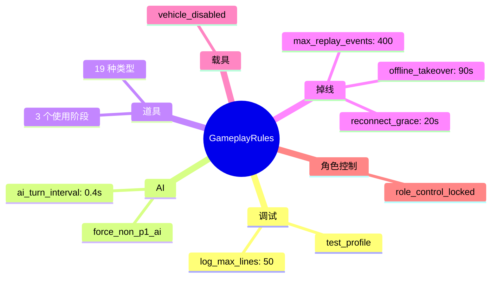
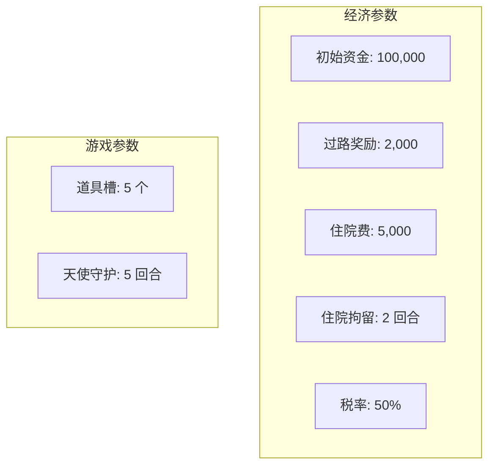
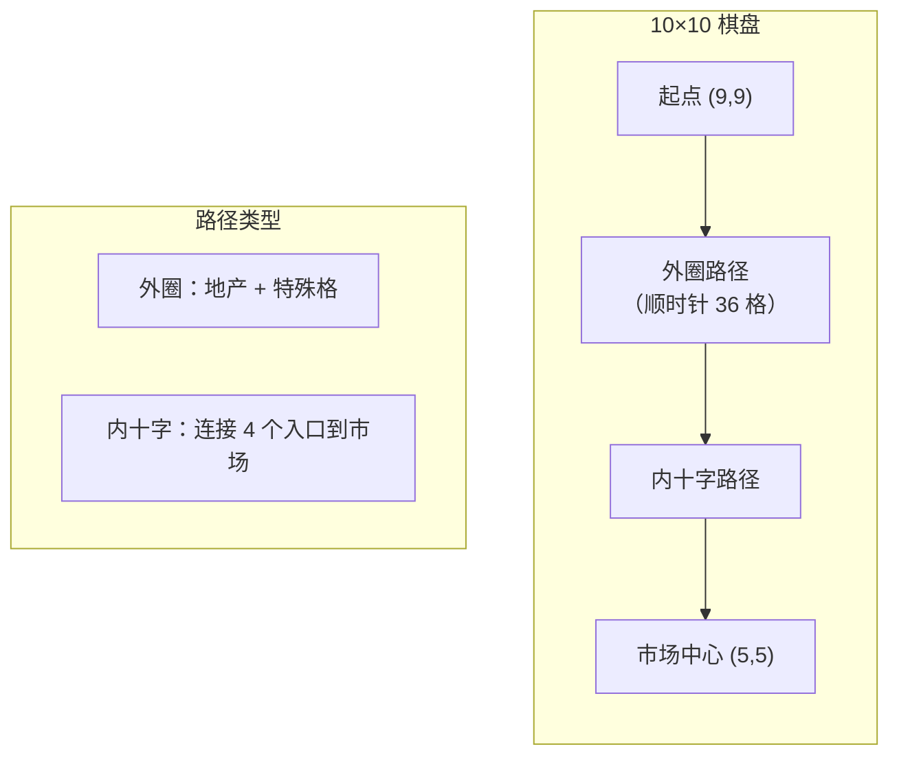

# 配置与数据模型


## 目的

描述内容配置（`Config/`）与运行时策略配置（`src/*/config`）的结构，帮助开发者理解游戏数据如何驱动运行时行为。


## 配置层结构

```text
Config/
├── Generated/            — 由设计表生成的游戏数据
│   ├── Tiles.lua         — 45 块格子定义
│   ├── Roles.lua         — 3 个角色定义
│   ├── Items.lua         — 19 种道具定义
│   ├── Vehicles.lua      — 12 种载具定义（4 档）
│   ├── ChanceCards.lua   — 机会卡牌池
│   ├── Constants.lua     — 数值常量（初始资金、过路费、税率等）
│   └── Market.lua        — 31 个商店商品
├── Maps/                 — 地图配置
│   ├── DefaultMap.lua    — 默认 10×10 棋盘
│   └── RingMapBuilder.lua — 地图构建器
└── RuntimeRefs.lua       — 运行时引用（资源映射）

src/
├── core/config/GameplayRules.lua                     — 游戏规则与调试开关
├── game/systems/land/config/LandingEffects.lua       — 13 种着陆效果定义
├── game/systems/commerce/config/RuntimePaidGoods.lua — 付费商品配置
├── app/testing/config/TestProfiles.lua               — 测试场景预设
└── core/config/RuntimeConstants.lua                  — 运动向量、速度、FPS
```


## 格子数据模型（Tiles）



棋盘共 45 格：24 块可购买地产、1 个起点、1 个医院、1 座山、1 个税务局、1 个市场、4 个机会卡格、2 个道具格，以及若干路径格。


## 道具数据模型（Items）



| 道具阶段 | 时机 | 示例 |
|----------|------|------|
| pre_action | 掷骰前 | 遥控骰子 |
| pre_move | 移动前 | 路障放置 |
| post_action | 着陆后 | 偷窃、导弹 |


## 载具数据模型（Vehicles）




## 着陆效果定义（LandingEffects）




## 游戏规则（GameplayRules）




## 数值常量（Constants）




## 地图结构（DefaultMap）



棋盘为 10×10 网格。外圈构成主路径，玩家沿此路径移动。中心有十字形内部路径连接到黑市。方向路由表定义了在每个交叉点的行进方向。


## 数据驱动设计

配置数据与代码逻辑完全分离。`Config/Generated/` 下的文件由 `docs/design/` 中的 Excel 设计表导出：

```text
docs/design/
├── 格子.xlsx        → Config/Generated/Tiles.lua
├── 道具.xlsx        → Config/Generated/Items.lua
├── 载具.xlsx        → Config/Generated/Vehicles.lua
├── 机会卡.xlsx      → Config/Generated/ChanceCards.lua
├── 角色.xlsx        → Config/Generated/Roles.lua
├── 常量.xlsx        → Config/Generated/Constants.lua
└── 商店.xlsx        → Config/Generated/Market.lua
```

修改游戏数值只需更新设计表并重新生成，无需修改代码逻辑。
