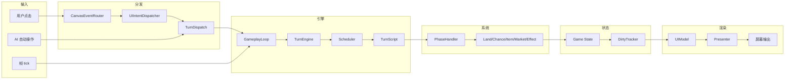
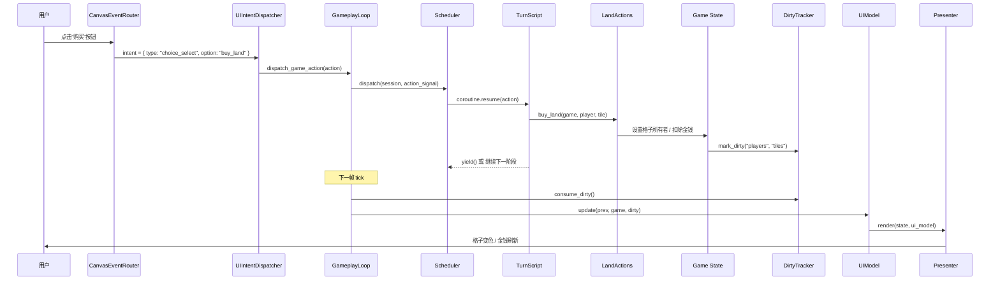
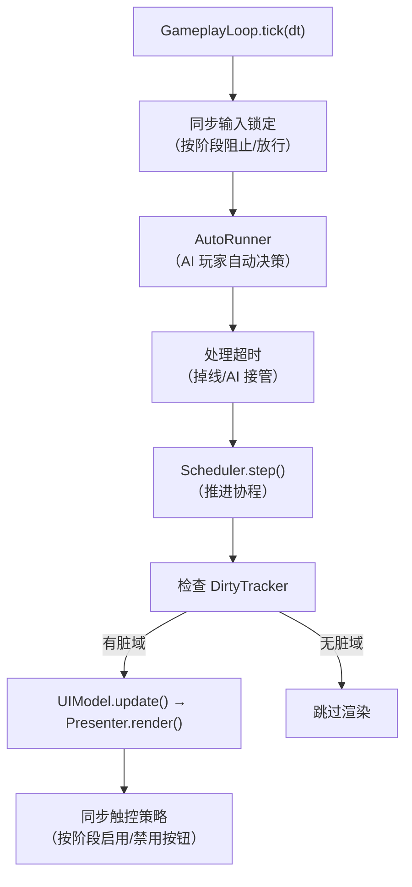
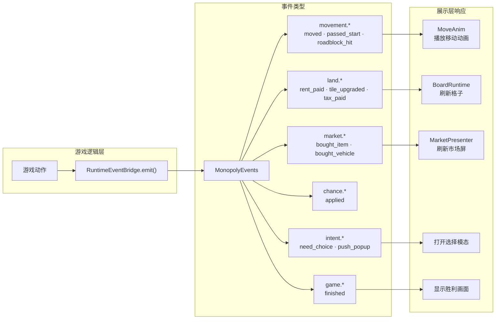
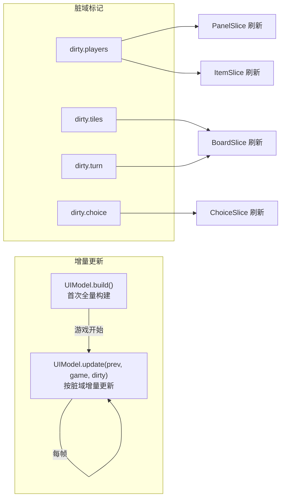

# 数据流

## 目的

描述从用户输入到游戏状态变更、再到 UI 渲染的端到端数据流。帮助开发者理解一个操作如何穿越所有层。

## 端到端数据流总览

## 用户操作：完整流转示例

以"玩家点击购买地产"为例：

## 帧 tick 数据流

每帧（30 FPS）GameplayLoop 执行以下流程：

## 事件流

游戏内部通过 MonopolyEvents 发送领域事件，事件桥接器转发到 UI 层：

## 状态同步策略

增量更新是性能关键：每帧只重算被标记为脏的切片，避免全量重建 UI 模型。
