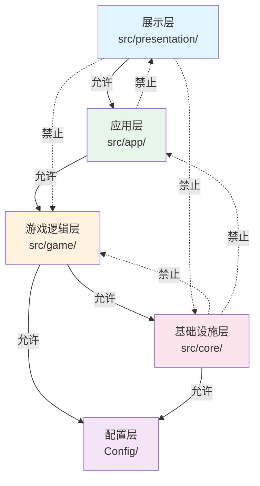
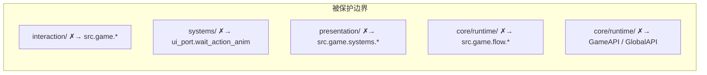
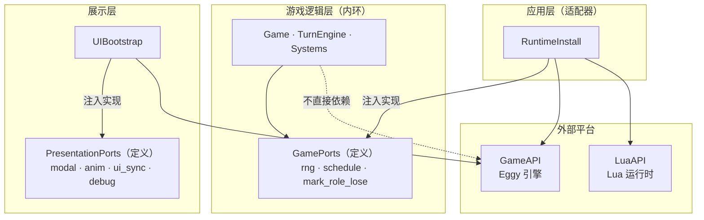
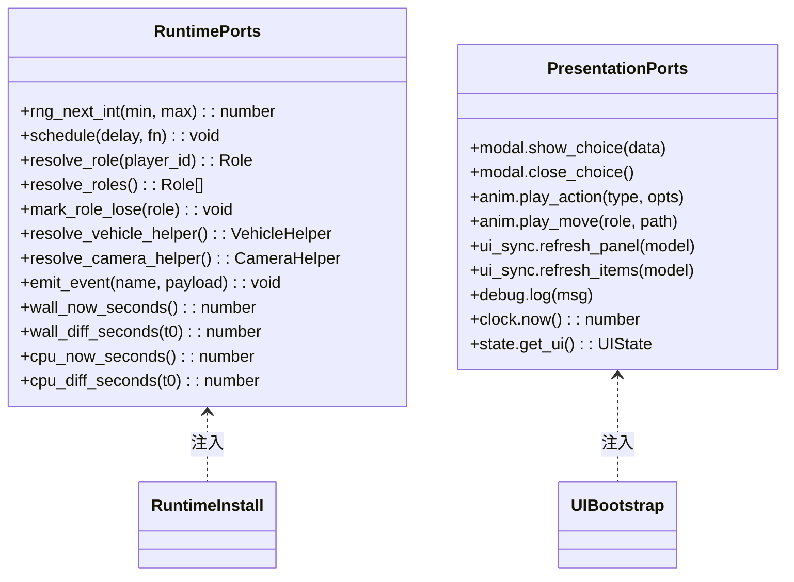
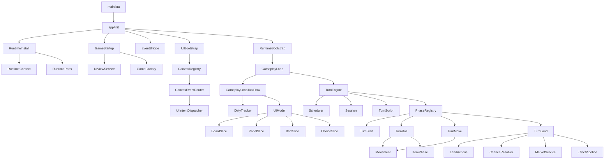

# 模块依赖关系

## 目的

描述各层与核心模块之间的依赖关系、依赖规则（dep_rules）以及端口适配器模式如何实现解耦。

## 层间依赖规则

**注意**：展示层不直接 require 游戏系统模块，而是通过端口接口（PresentationPorts）间接访问游戏状态。

## dep_rules 强制规则

`tests/internal/dep_rules.lua` 扫描源码中的 require 语句，强制执行以下约束：

| 规则 | 含义 |
|------|------|
| interaction ✗→ game | 交互层不能直接依赖游戏逻辑，只能通过 intent 分发 |
| systems ✗→ ui_port | 游戏系统不能直接调用 UI 等待，保持纯逻辑 |
| presentation ✗→ game.systems | 展示层不能直接引用游戏子系统 |
| core/runtime ✗→ game.flow | 基础设施不能依赖上层流程 |
| core/runtime ✗→ GameAPI | 核心运行时不能依赖平台全局 API |

## 端口适配器模式

## RuntimePorts 详细接口

## 核心模块依赖图

## 测试如何守护依赖

回归测试（`lua tests/regression.lua`）在所有功能测试通过后，额外运行：

1. **dep_rules** — 扫描 `src/` 下所有 `.lua` 文件的 require 语句，检查是否违反层间依赖规则
2. **forbidden_globals** — 扫描 `src/` 下所有 `.lua` 文件，确保不使用运行时沙箱中不存在的全局函数（如 `tonumber`）

任何违反会导致回归测试失败，防止架构退化。
