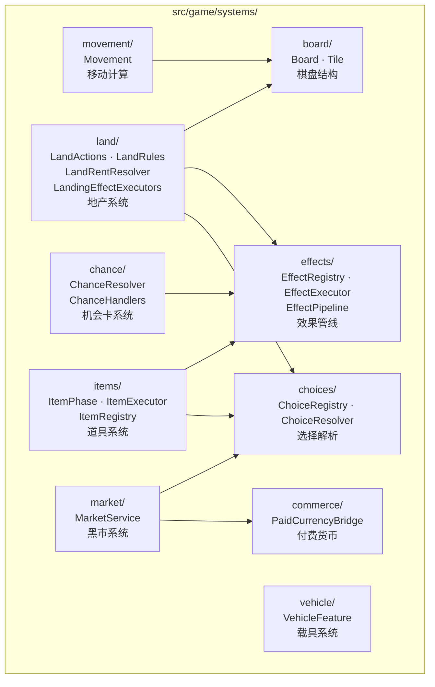
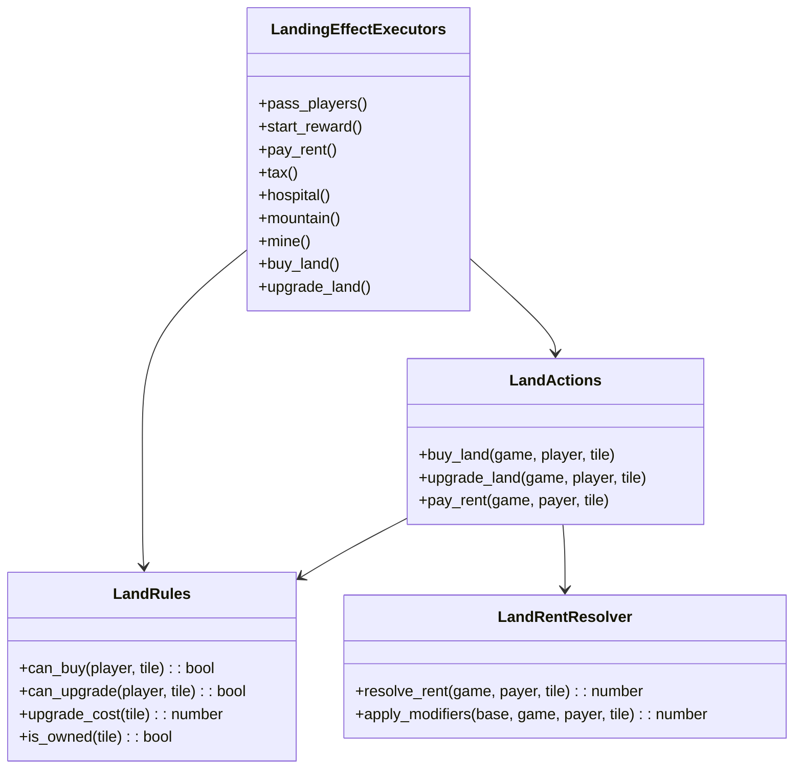
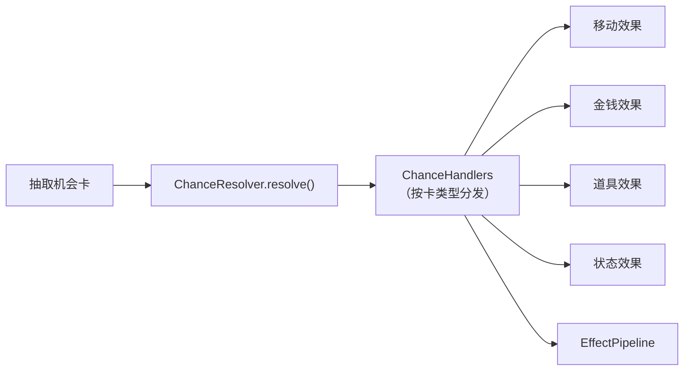
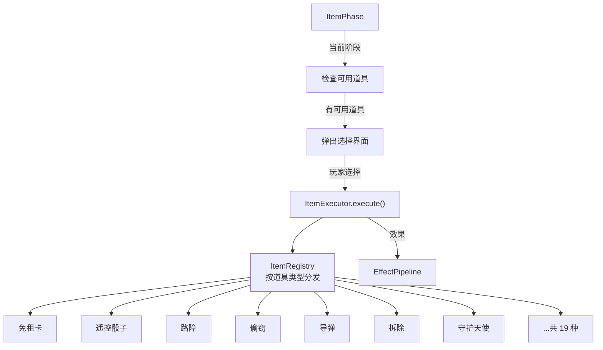
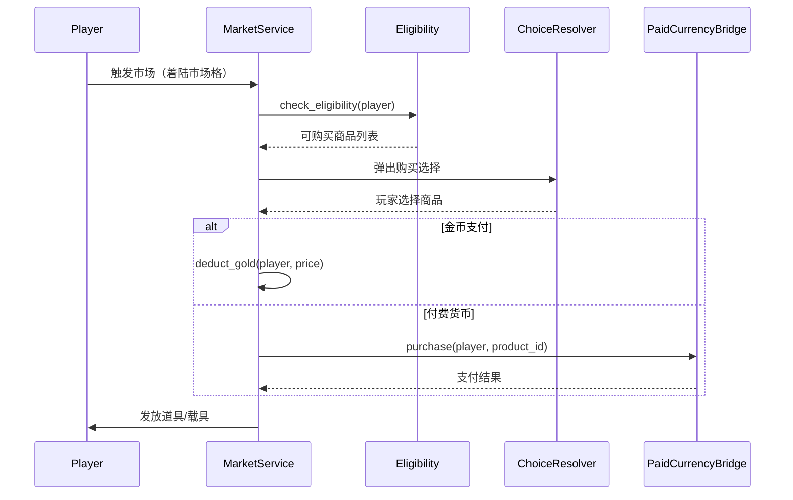
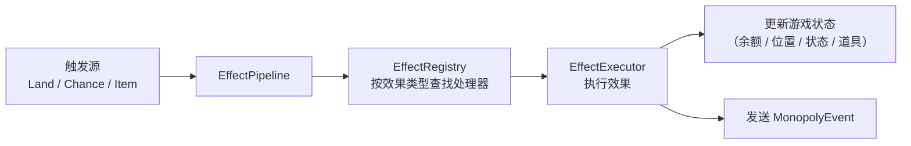
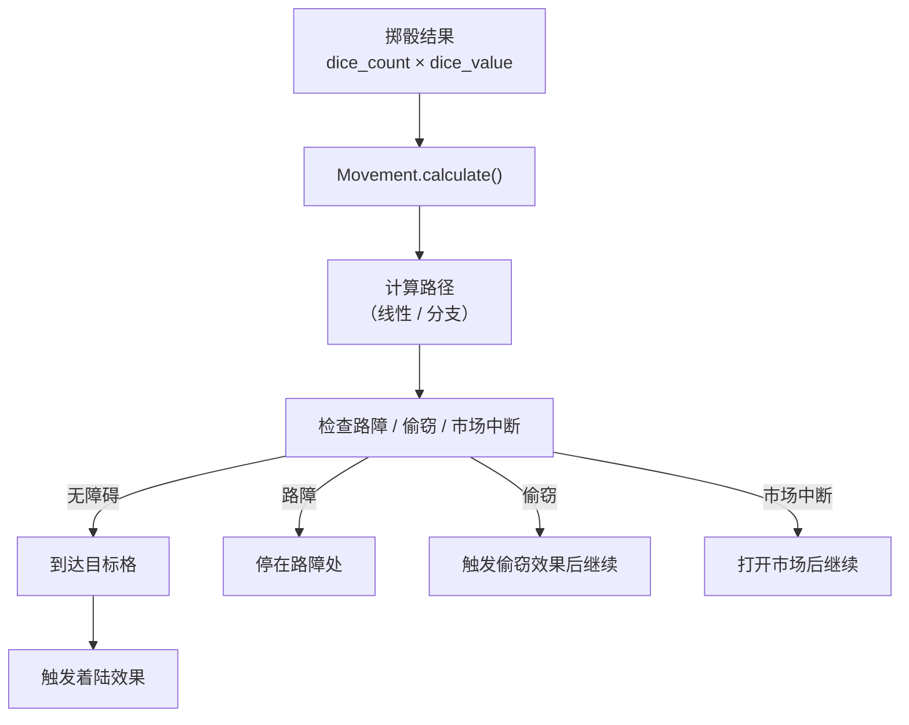
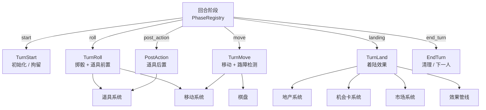

# 游戏子系统

## 目的

描述 `src/game/systems/` 下各子系统的职责、接口与协作关系。这些子系统实现大富翁的核心游戏机制，由回合阶段（PhaseRegistry）在适当时机调用。

## 子系统总览

## 地产系统（Land）

## 机会卡系统（Chance）

## 道具系统（Items）

道具在回合的三个时机执行：掷骰前（pre_action）、移动前（pre_move）、着陆后（post_action）。

## 市场系统（Market）

## 效果管线（Effects）

## 移动系统（Movement）

## 子系统协作全景

