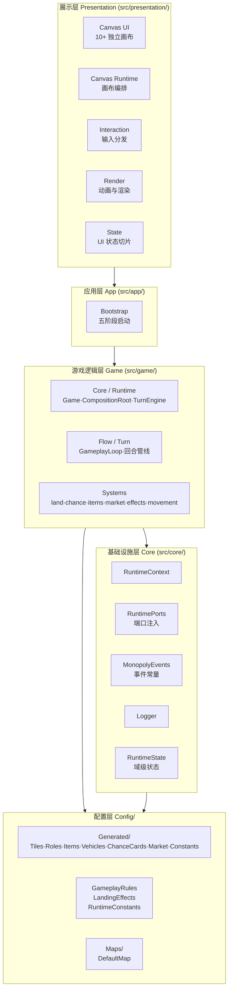
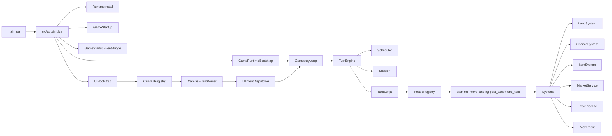

# 全局架构总览

## 目的

本文档描述 Monopoly 项目的整体分层架构与核心组件关系，为后续各专题文档提供导航索引。

## 分层架构

项目采用 **分层 + 端口适配器** 的混合架构。自底向上共五层，每一层只允许依赖同层或更下层的模块。

## 组件关系图

## 目录索引

| 文档 | 主题 |
|------|------|
| [bootstrap.md](bootstrap.md) | 启动序列时序图 |
| [turn-engine.md](turn-engine.md) | 回合引擎状态机与协程流程 |
| [game-systems.md](game-systems.md) | 游戏子系统组件图 |
| [presentation.md](presentation.md) | 展示层 Canvas 架构与交互流 |
| [data-flow.md](data-flow.md) | 端到端数据流图 |
| [dependencies.md](dependencies.md) | 模块依赖关系图 |
| [config-data.md](config-data.md) | 配置与数据模型图 |
