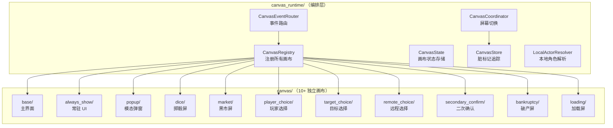
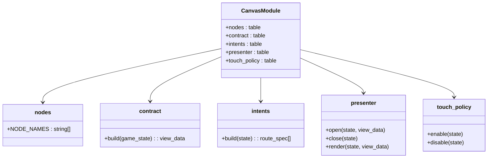
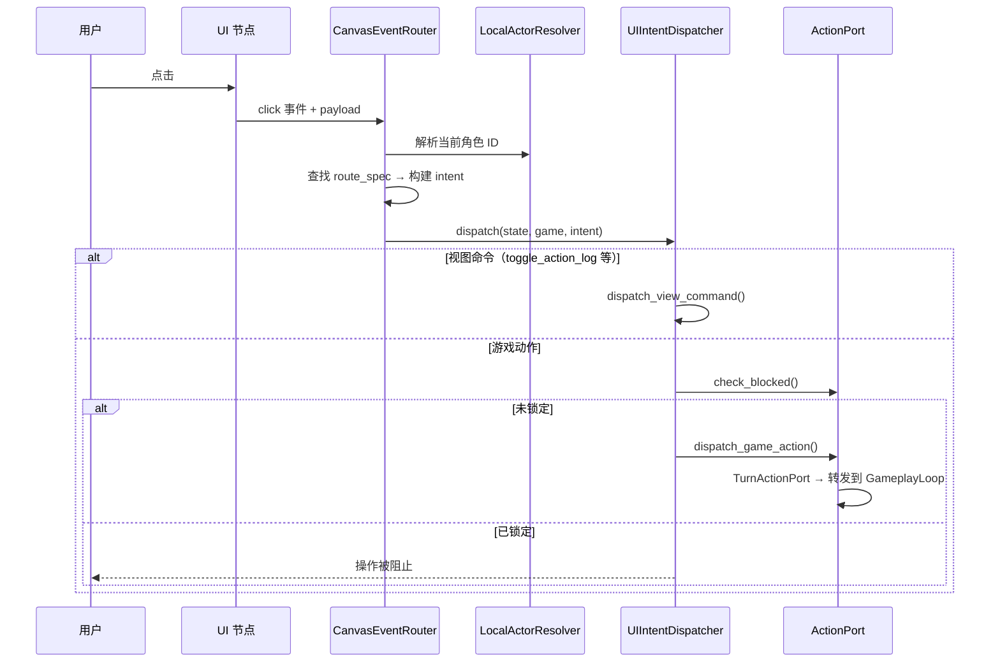
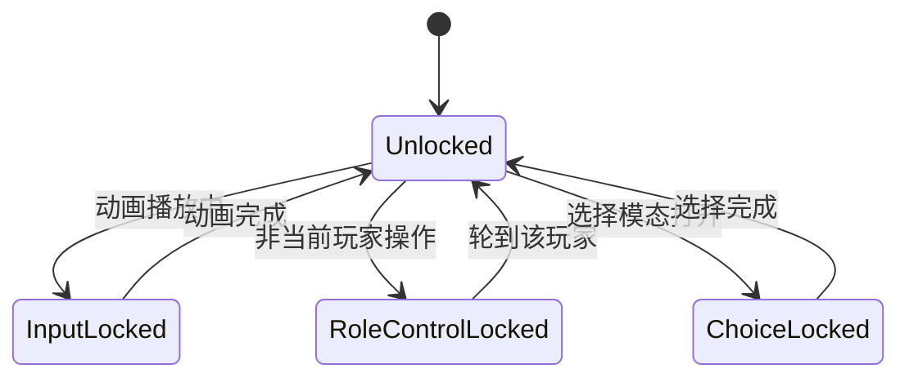
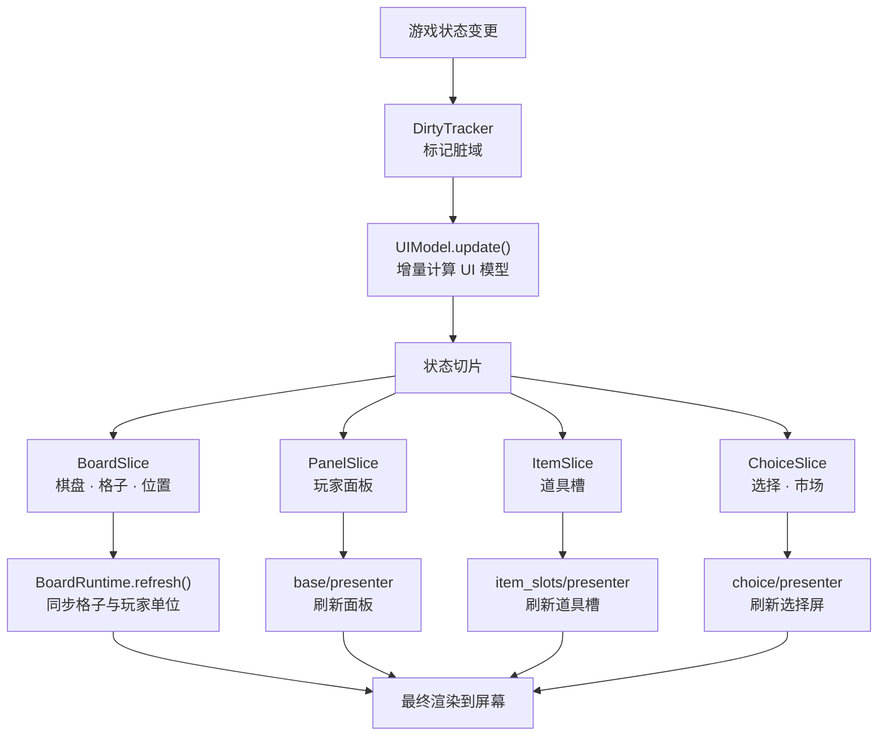
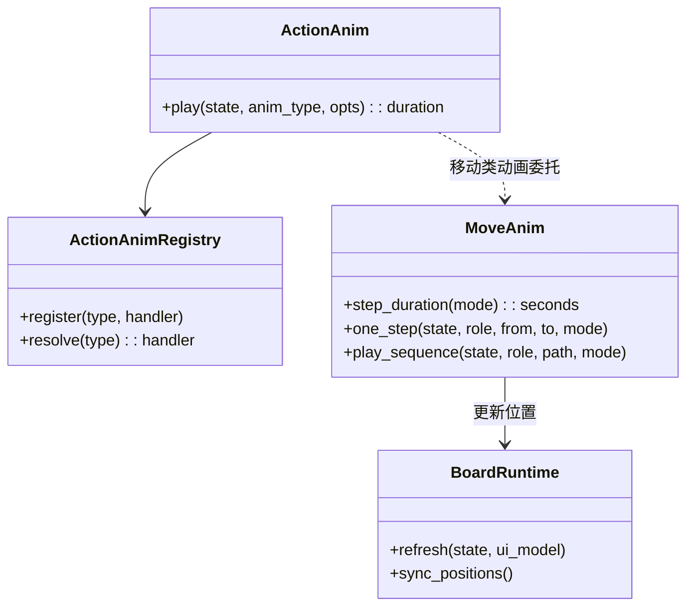

# 展示层架构


## 目的

描述 `src/presentation/` 的 Canvas-First 架构、交互分发流程与渲染管线。展示层负责将游戏状态映射到 UI 节点树，并将用户输入转化为游戏动作。


## Canvas-First 架构

每个 UI 屏幕（Canvas）是自包含的模块，包含节点定义、数据契约、交互意图、呈现逻辑和触控策略。画布之间不直接引用，所有跨画布编排通过 `canvas_runtime/` 完成。




## 单个画布结构

```text
src/presentation/canvas/<canvas_key>/
  nodes.lua          — UI 节点名称常量
  contract.lua       — 数据契约（画布需要的输入数据）
  intents.lua        — 交互意图（点击事件 → intent 对象）
  presenter.lua      — 呈现逻辑（open / close / render）
  touch_policy.lua   — 触控启用/禁用策略
```




## 交互分发流程




## 输入锁定策略




## 渲染管线




## 动画系统



动画类型包括：`roll`（掷骰）、`roadblock`（路障）、`mine`（地雷）、`missile`（导弹）、`clear_obstacles`（清除障碍）。


## 展示层目录结构

```text
src/presentation/
├── api/                  — 服务 API（UIViewService · PresentationPorts）
│   ├── presentation_ports/  — 端口接口定义
│   └── ui_view_service/     — 视图命令实现
├── canvas/               — 10+ 独立画布模块
├── canvas_runtime/       — 画布编排（Registry · State · EventRouter · Store）
├── interaction/          — 输入处理（IntentDispatcher · TouchPolicy · ChoiceRoute）
├── render/               — 渲染（ActionAnim · MoveAnim · BoardRuntime · TileRenderer）
├── state/                — UI 状态（UIModel + 4 个切片）
├── read_model/           — 只读游戏状态查询
├── shared/               — 常量与工具（UIAliases · PlayerColors · UIEvents）
└── ui/                   — UI 组件（面板 · 模态 · 效果）
```
