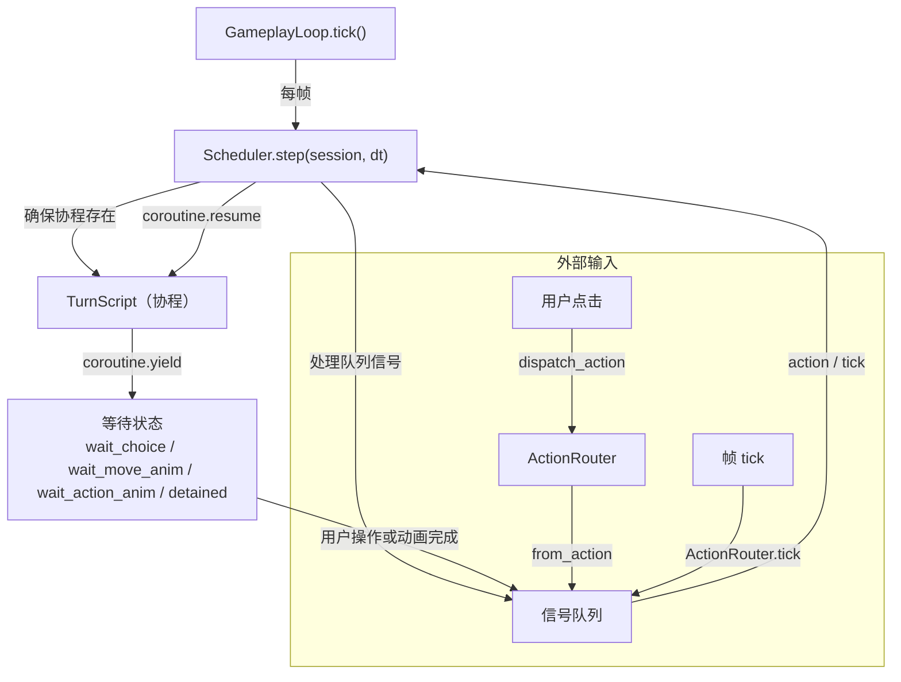
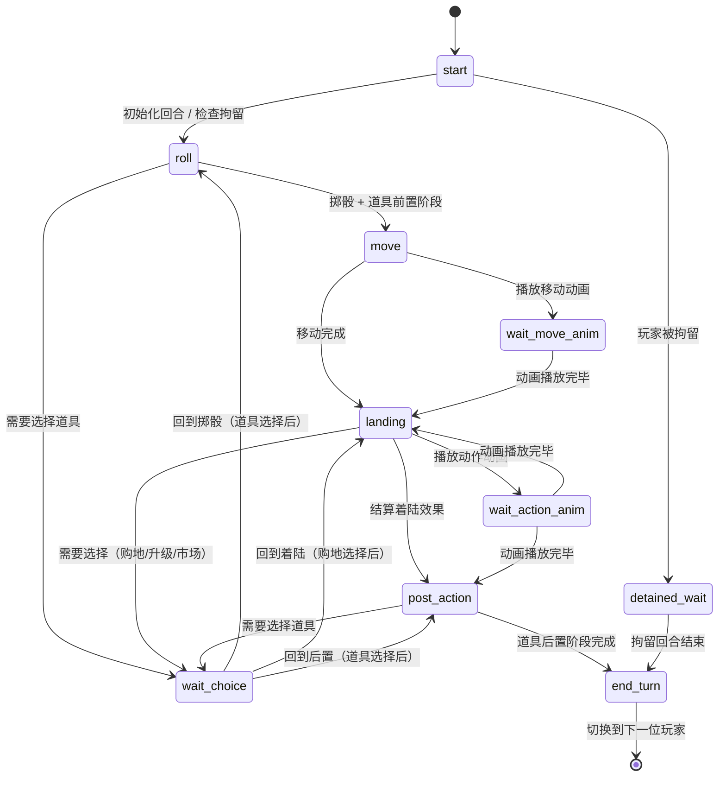
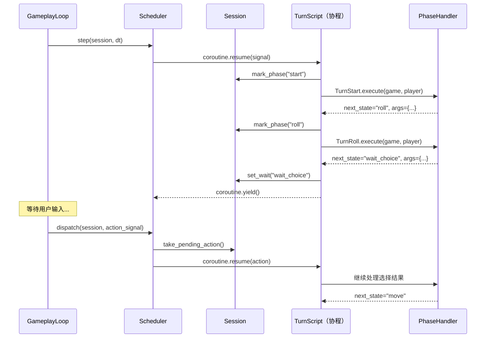
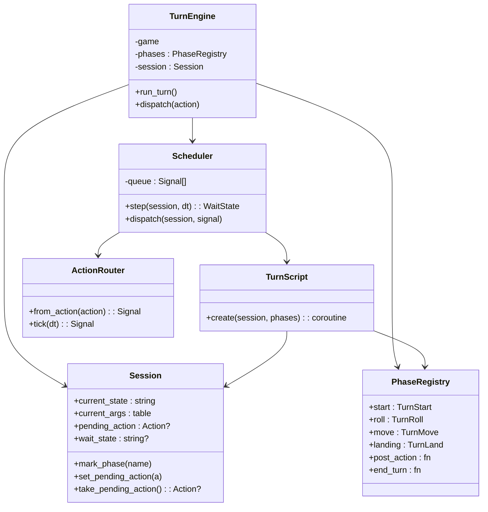

# 回合引擎

## 目的

描述回合引擎的状态机、协程调度模型以及阶段流转逻辑。回合引擎是游戏的核心运行时——每个玩家的回合由 Lua 协程驱动，在需要等待（玩家输入、动画播放）时挂起，收到信号后恢复。

## 协程调度模型

## 回合阶段状态机

PhaseRegistry 定义了六个主阶段，TurnScript 按顺序执行它们。每个阶段可以转入等待状态，也可以直接转入下一阶段。

## 协程与 Session 交互

## TurnEngine 内部结构

## 关键设计特征

**协程即状态机**：传统状态机需要手动维护状态变量与转移表；此处用 Lua 协程的 yield/resume 天然表达等待与恢复，代码以线性流程书写，读起来像同步代码。

**信号队列解耦**：用户操作与帧 tick 统一进入 Scheduler 队列，TurnScript 无需区分信号来源。

**阶段可插拔**：PhaseRegistry 返回的是普通函数表，新增阶段只需实现 `execute(game, player)` 并注册即可。
