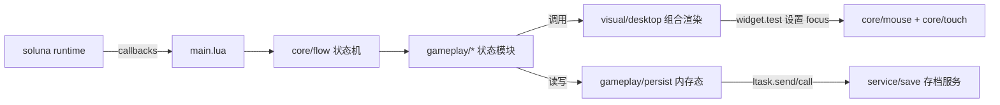

# Deep Future 架构拆解（Lua 跨平台游戏）

本系列文档从 `deepfuture` 工程中抽取可复用的“Lua 跨平台游戏”架构模式，面向希望用 Lua（或 Lua 方言）做桌面/网页/多平台游戏的开发者。

## 读者与目标

- 读者：能读懂 Lua、了解基本游戏循环/渲染/UI 概念的工程师。
- 目标：看完后可以复用本工程的分层方式（逻辑/表现/服务）、状态机组织、数据驱动资源、输入与存档的工程实践。

## 快速总览

### 目录分层（“逻辑 / 表现 / 服务”）

- `core/`：通用基础设施（状态机、输入、widget/layout、语言与设置等）
- `gameplay/`：游戏规则与状态推进（各阶段逻辑、卡牌/地图/轨道等模型）
- `visual/`：渲染与交互表现（桌面 UI 组合、region 动画、按钮/提示等）
- `service/`：后台服务（主要是存档服务），通过 `ltask` 与主线程通信
- `asset/`：图片 + 资源描述（`.dl` 数据文件、layout 描述、sprite/icon 列表）
- `localization/`：本地化数据（`.dl`）
- `soluna/`：运行时/引擎（子模块），提供跨平台窗口、渲染、文件、任务等能力

### 核心数据流（Mermaid）

## 阅读顺序

1. 入口与帧循环：`./01-entry-and-loop.zh-CN.md`
2. 状态机与协程调度：`./02-flow-state-machine.zh-CN.md`
3. 数据驱动资源与配置：`./03-data-driven-assets.zh-CN.md`
4. UI/渲染组织：`./04-ui-rendering.zh-CN.md`
5. 输入系统：`./05-input.zh-CN.md`
6. 存档与后台服务：`./06-persistence-services.zh-CN.md`
7. 本地化与字体：`./07-localization-fonts.zh-CN.md`
8. Web 构建与发布：`./08-build-and-deploy.zh-CN.md`

## 本工程可复用的“架构要点清单”

- **单入口 + 回调表**：`main.lua` 返回 callback 表给引擎，集中承接事件（帧、输入、resize）。
- **协程驱动的状态机**：逻辑以状态模块组织，每个状态是“可 yield 的函数”，用 `flow.sleep()` 把动画与等待写成同步代码。
- **数据驱动 UI 与配置**：`.dl` 文件承载 UI 配置/资源表/layout；Lua 只做“行为与动态生成”。
- **渲染与可点击区域统一**：同一套 layout 既能生成 draw list，也能生成 test list，用于命中测试与 focus 管理。
- **后台服务隔离 I/O**：主线程只维护内存态，存档与校验在 `service/` 中完成，避免卡顿与数据腐化。
