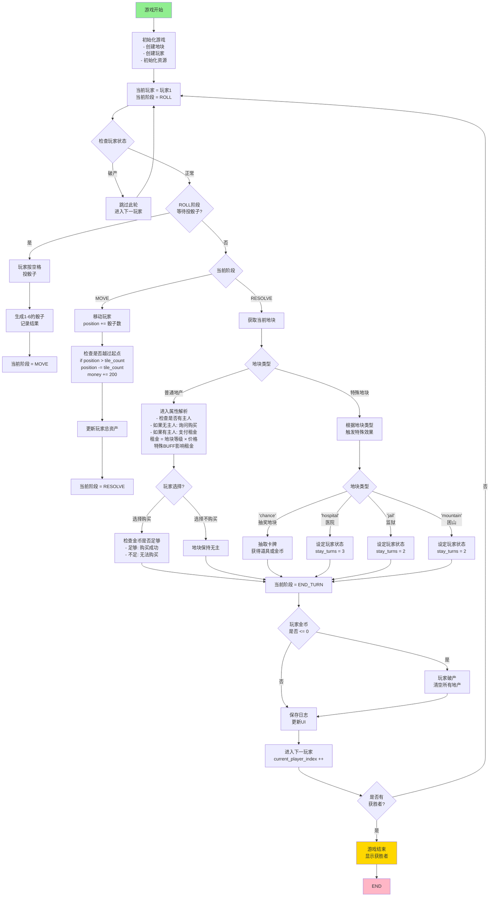

# 蛋仔大富翁 - 游戏主流程图



## 关键流程说明

### 1. **ROLL 阶段** (投骰子)
- 玩家按空格键投骰子
- 生成1-6的随机数
- 转移到 MOVE 阶段

### 2. **MOVE 阶段** (移动)
- 玩家沿着地板顺时针移动
- 如果越过起点(position > tile_count)，回到起点并获得200元
- 转移到 RESOLVE 阶段

### 3. **RESOLVE 阶段** (触发效果)

#### 3.1 普通地产处理
- **无主人** → 询问购买
  - 有金币 → 购买成功
  - 没金币 → 保持无主
- **有主人** → 支付租金
  - 租金 = 地块等级 × 基础租金
  - 受 BUFF (贫困/富有) 影响

#### 3.2 特殊地块处理
- **抽奖地块** → 抽卡牌获得道具或金币
- **医院** → 困3轮，每轮恢复1点健康
- **监狱** → 困2轮
- **困山** → 困2轮

### 4. **破产检查**
- 如果玩家金币 ≤ 0 → 破产
- 清空所有地产并退出游戏

### 5. **END_TURN 阶段** (回合结束)
- 检查是否有获胜者(其他玩家都破产)
- 轮转到下一个玩家
- 重新开始 ROLL 阶段

## 游戏状态机

```
ROLL → MOVE → RESOLVE → END_TURN → ROLL (下一玩家)
  ↑                                    ↓
  └────────────────────────────────────
```

## 玩家可用操作

| 按键 | 功能 |
|------|------|
| **空格** | 投骰子 / 下一步 |
| **A** | 切换自动/手动模式 |
| **B** | 购买地产 |
| **U** | 升级地产 |
| **S** | 跳过操作 |
| **H** | 帮助 |
| **ESC** | 退出游戏 |
