# AI 策略审查 · 2026-05-04

调查方法：grep + Read 静态扫描，对照 `docs/product/design-source/蛋仔策划案--大富翁.docx` 文末「AI」章节逐条比对。
**结论：19/19 一致，AI 实现完整复现策划案。**

```mermaid
flowchart TB
  T["AI 实现 vs 策划案：19/19 一致 ✅"]:::title

  subgraph G1 ["基础行为 2/2"]
    direction TB
    A1["AI 全程点击确认<br/>decision.lua:78-84"]:::ok
    A2["有道具必定使用<br/>strategy.lua:120-154"]:::ok
  end

  subgraph G2 ["遥控骰子 3/3"]
    direction TB
    B1["10 级优先级（道具→机会→空地→己地→起点→黑市→深山→税务→医院→他人地）<br/>path.lua:23-43"]:::ok
    B2["同 rank 选最远<br/>path.lua:120-125"]:::ok
    B3["他人地选最低租金<br/>path.lua:40-41（score=-rent）"]:::ok
  end

  subgraph G3 ["路障 2/2"]
    direction TB
    C1["7 级优先级（前道具→前空地→前机会→后己地→后医院→后税务→后深山）<br/>roadblock.lua:85-121"]:::ok
    C2["无满足则暂不用<br/>strategy.lua:100-104"]:::ok
  end

  subgraph G4 ["拆除（怪兽/导弹）3/3"]
    direction TB
    D1["前后 3 内 + 拆总价值最高<br/>strategy.lua:80-82 + demolish.lua:107-124"]:::ok
    D2["无目标则暂不用<br/>_has_demolish_target"]:::ok
    D3["导弹同怪兽<br/>strategy.lua:142-146"]:::ok
  end

  subgraph G5 ["目标选择卡 8/8"]
    direction TB
    E1["偷窃默认第一张<br/>steal.lua:102"]:::ok
    E2["均富（自己最多则暂不）<br/>action.lua:44-49"]:::ok
    E3["流放 = 选他人最富<br/>action.lua:71-72"]:::ok
    E4["查税 = 选他人最富<br/>action.lua:71-72"]:::ok
    E5["穷神 = 选他人最富<br/>action.lua:71-72"]:::ok
    E6["请神（先他人天使，次他人财神，否则暂不）<br/>action.lua:51-64"]:::ok
    E7["送神（自己有穷神才用）<br/>action.lua:77-81"]:::ok
    E8["其他卡能用则用<br/>strategy probe"]:::ok
  end

  subgraph G6 ["玩家自动 1/1"]
    F1["自动逻辑同 AI<br/>path.lua:9-11（is_ai or auto）"]:::ok
  end

  classDef title fill:#ccffcc,stroke:#009900,stroke-width:3px,font-weight:bold
  classDef ok fill:#e6ffe6,stroke:#009900
```

## 备注

- 试玩反馈 B3「AI→玩家租金成倍」属于租金计算 bug，与 AI 策略无关，按 backlog 单独追踪。
- 后续若策划案改版（如新增地产 ROI 决策），再立条目跟进。当前实现无需调优。
