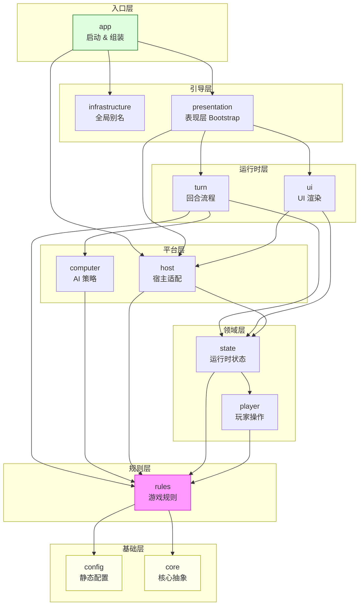

# 大富翁 `src/` 代码库全模块分析报告

> 基于 6 名分析员并行阅读 230+ 个 `.lua` 文件的结果汇总
> 生成日期：2026-03-20

---

## 一、整体架构

项目采用**六边形架构（Hexagonal Architecture / Ports & Adapters）**，核心思想是游戏规则层对宿主引擎和 UI 层**零硬依赖**，所有副作用通过注入的 `port` 接口完成。整体分 4 个大圈层：

```
┌─────────────────────────────────────────────────────────┐
│  宿主层 host/                    ← Eggy 引擎 SDK 适配   │
│  应用层 app/                     ← 启动 & 依赖组装       │
│  ┌────────────────────────────────────────────────────┐ │
│  │  表现层 ui/                    ← UI 渲染 & 事件桥    │ │
│  │  ┌──────────────────────────────────────────────┐  │ │
│  │  │  回合层 turn/              ← 协程状态机驱动   │  │ │
│  │  │  ┌──────────────────────────────────────────┐│  │ │
│  │  │  │  规则层 rules/          ← 纯游戏逻辑      ││  │ │
│  │  │  │  核心层 core/ player/ computer/           ││  │ │
│  │  │  │  数据层 config/ state/  ← 静态配置+状态    ││  │ │
│  │  │  └──────────────────────────────────────────┘│  │ │
│  │  └──────────────────────────────────────────────┘  │ │
│  └────────────────────────────────────────────────────┘ │
└─────────────────────────────────────────────────────────┘
```

---

## 二、各模块详述

### `config/` + `state/` — 静态数据 & 运行时状态

**config/** 纯只读数据，启动时一次性加载：

- `content/`：地图（45格 9×9 外环+内十字通道）、34张机会卡、19种道具、3角色/6皮肤、26条市场商品、资源 asset 映射
- `gameplay/`：规则常量（起始资金 10万、骰子1个、超时15s、税率50%…）、feature 开关（载具=false）、3D 引擎参数
- `testing/`：17个预置测试场景（按名称/分组/覆盖点索引）

**state/** 运行时动态状态，分三层：

- 核心状态（`game_state` mixin 聚合 `board_state` + `player_state` + `turn_state`）
- `dirty` 标记系统（`any/players/board_tiles/turn`）按需驱动 UI 刷新
- `state_access/`：runtime namespace 隔离（UI/anim/board/turn/debug 各自独立命名空间）；`landing_visual_hold` 精细控制落地动画期间的视觉冻结-缓冲-有序回放

**关键设计模式**：

| 模式 | 位置 |
|------|------|
| Port 注入 | `game_state` 的所有副作用通过注入 port 完成，测试时替换为 no-op |
| dirty 追踪 | `game.dirty.{any, players, board_tiles, turn}` 集中标记需同步的部分 |
| Mixin 聚合 | `game_state.lua` 通过 mixin 合并三个分片，保持文件单一职责 |
| runtime namespace 隔离 | `runtime_state.lua` 将运行时辅助状态分隔成独立 namespace |
| 落地视觉保持 | `landing_visual_hold`：冻结→缓冲→按优先级回放 |

---

### `core/` + `player/` + `computer/` — 核心抽象、玩家操作、AI 策略

#### core/choice（四层协作）

| 文件 | 职责 |
|------|------|
| `contract.lua` | 定义 12 个标准字段（route_key/requires_confirm/owner_role_id 等） |
| `registry.lua` | 按 kind 注册 handler descriptor（含 normalize_meta/validate/execute 钩子） |
| `resolver.lua` | 核心执行引擎，处理取消兜底、option 校验、descriptor.execute 调用 |
| `route_policy.lua` | 解析 route_key，映射到画布（base_inline/secondary_confirm/player 等） |

#### core/events

统一事件命名空间（movement/land/market/chance/feedback/game/intent），内部经 `runtime_ports.emit_event` 转发，支持 feature_key 级开关。

#### core/ports

`runtime_ports`（全局 6 类端口：rng/schedule/role/event/time/helper）通过 `configure()` 注入，`reset_for_tests()` 支持隔离。

#### player/actions

5 个 ops 子模块（balance/location/status/deity/vehicle），原子操作 + `mark_dirty`，`find_player_by_id` 有缓存加速。

`player/choices` 层是纯转发，全部 re-export core 实现，无额外逻辑。

#### computer/core_agent（AI 策略）

- **骰子选择**：枚举 1-6，模拟落点，10 级优先级打分（item格 > 机会 > 无主地 > … > 对手高租金地）
- **目标玩家**：share_wealth/exile/invite_deity/send_poor 各自策略
- **choice 自动响应**：按 kind 分派，未知 kind 返回 nil（安全降级）

---

### `rules/` — 游戏规则引擎

**组装入口**：`bootstrap/registries.create_registries()` 统一创建 4 个注册表（items/choices/chances/effects）。

#### 子模块职责速查

| 子模块 | 职责 |
|--------|------|
| `board` | Tile 类、地块查询、朝向策略 |
| `effects` | 通用 Effect 管道（registry→runner→pipeline，mandatory/optional 分流） |
| `land` | 落地规则（纯计算层 rules + 调用层 actions + 4大 executor：buy/upgrade/pay_rent/tax） |
| `chance` | 机会卡（天使保护检查→handler 路由→cash/asset/movement 三组） |
| `items` | 道具系统（registry handler + post_effects + 背包管理 + 道具使用阶段） |
| `market` | 黑市购买（本地金币扣款 or 付费异步回调两路） |
| `endgame` | 破产（清资产+角色 die）& 胜利（存活≤1人 or 超轮限比总资产） |
| `commerce` | 地块商业价值计算、付费商品规格 |
| `ports` | 6个 port 抽象（intent_output/bankruptcy/auto_play/board_visual_feedback/bankruptcy_feedback/paid_purchase） |

#### 核心运行链

```
落地触发
  → effect_pipeline.run
  → effect_runner.scan / execute
  → executor.apply
  → intent_output_port.dispatch（向 UI 推送 choice 或弹窗）
```

#### 关键业务流程

**地块落地**：effect_pipeline 扫描 12 条 effect → 强制 effect 依次执行 → 可选 effect 构建 choice spec → waiting 等待玩家决策

**机会卡**：chance_draw_and_resolve executor → 检查天使保护 → 路由到 cash/asset/movement handler

**市场购买**：market effect → 构建 choice → `purchase/core.execute` → 验证 → 本地扣款 or 付费异步回调

**道具使用**：registry handler（特化逻辑）or 通用 post_effects → action_anim → use_broadcast 通知观察者

**破产/胜利**：支付后余额不足触发 `bankruptcy.eliminate`；每轮末 `game_victory.check_victory` 检查存活数 & 总资产

#### ports 层抽象方式

所有 port 文件均不直接持有实现，统一通过 `contract_helper` 在运行时从 `game` 对象上按字段名解析：

```lua
-- 必要 port（缺失则 assert 报错）
contract_helper.call_required_method(game, "bankruptcy_port", ...)
-- 可选 port（缺失则返回 default_result，不报错）
contract_helper.call_optional_method(game, "intent_output_port", ...)
```

---

### `turn/` — 回合流程控制（协程 + tick 双层驱动）

#### 协程层（`timing/session_script`）

驱动阶段状态机，异步等待通过 `coroutine.yield` 挂起：

```
start → wait_action → roll → move → move_followup → landing → post_action → end_turn → (inter_turn_wait) → start(下一玩家)
```

| 阶段 | 职责 |
|------|------|
| `start` | 初始化 last_turn，触发 turn_started 事件，处理被消除/扣留玩家，运行 pre_action 道具阶段 |
| `roll` | 投骰子（支持 override 和 multiplier），运行移动前阶段的道具逻辑；`pre_move` 只是阶段名，不是主动展示窗口 |
| `move` | 执行棋盘移动，检测市场/steal 中断，等待 move_anim |
| `move_followup` | 处理中断/进入 landing/重新触发 landing/apply_location_effects |
| `landing` | 触发 effect_pipeline，处理链式重定位，协调多层等待 |
| `post_action` | 运行 post_action 道具阶段，结束后进入 end_turn |
| `end_turn` | 清除临时标记、延迟 inter_turn_wait，调用 next_player |

#### tick 层（`loop/tick_flow`，每帧）

执行顺序：
1. 同步 landing_visual_hold 状态
2. 更新输入锁定标志（phase 决定）
3. 更新角色控制锁
4. AI 自动推进（auto_runner）
5. 所有计时器步进（选择超时/弹窗超时/行动按钮/扣留/回合间）
6. 动画驱动（wait_move_anim / wait_action_anim）
7. dirty → UI 刷新 + 摄像机 + 3D 状态同步

#### waits/ 异步等待原语

`await.action/choice/move_anim/action_anim/landing_visual/detained/inter_turn`，通过 `callback_registry` 支持动画结束后插入"续集状态"。

#### policies/ 层

| 文件 | 职责 |
|------|------|
| `action_gate` | 枚举需屏蔽的 action type，popup_confirm/auto button 可直接放行 |
| `auto_runner` | AI 推进器，0.15s 间隔 + 签名防抖（actor/wait_kind/choice_id 变化时重置） |
| `timer_policy` | 行动按钮 / 扣留 / 回合间 三组超时倒计时 |
| `role_control_policy` | 锁定非当前回合玩家的角色控制 |

#### output/ 适配器层（规则层 ↔ UI 层桥接）

- `intent_dispatcher`：规则层输出网关（need_choice → pending_choice + emit；push_popup → popup_port）
- `output_state_adapter`：将 UI model / pending_choice / modal_timer 写入 `runtime_state`
- `anim.lua`：动画驱动，收到 done 信号后清除 turn 中的 anim 数据并推进状态机

---

### `app/` + `host/` + `infrastructure/` — 启动层 & 宿主适配

#### 启动流程

```
宿主引擎加载 init.lua
  → logger 初始化
  → startup_policy 读全局变量（build_mode/profile_name）
  → host_install
      a. config_sanity.validate()
      b. runtime_context.new()       ← 创建上下文
      c. global_aliases.install()          ← 安装宿主桥接例外
      d. runtime_ports.configure()   ← 注册 port 实现
      e. 触发规则模块加载（破产/AI/胜利）
  → roster 构建玩家名单（真实角色 + 补 AI 合成角色）
  → composition_root.assemble
      a. game_factory.build_board/players/rng
      b. 注入所有依赖（turn/dirty/registries/ports）
  → ui_bootstrap.install
      a. 首局游戏创建
      b. 加载屏序列（show → 延迟1s → hide，显示基础屏）
  → gameplay_loop 接管
```

#### host/ 宿主适配层

| 文件 | 职责 |
|------|------|
| `eggy.lua` | 宿主门面，代理 units/sound/raycast/scene_ui/event_bridge 等 |
| `context.lua` | 运行时全局上下文单例（GameAPI/LuaAPI env + 各 helper） |
| `default_ports.lua` | port 实现工厂（rng/schedule/emit_event/resolve_role 等） |
| `event_bridge.lua` | 自定义事件桥，触发失败后永久禁用该 feature_key（断路器模式） |
| `paid_purchase_gateway.lua` | 付费购买网关（维护 pending 队列 + 回调处理） |
| `synthetic_actor_registry.lua` | AI 合成角色 → 与真实 role 同接口的适配器 |

`src/host/global_aliases.lua`：将 `LuaAPI.SetTimeOut/RegisterCustomEvent/…` 注入全局，作为宿主桥接的显式 seam exception，而不是业务兼容别名层。

---

### `ui/` — 表现层

#### 分层架构

```
ui/ports/                运行时依赖注入接口组
ui/ctl/                   控制器层（协调 canvas 和 modal）
  └─ canvas_coordinator    canvas 切换（命名事件广播）
  └─ canvas_event_router   点击事件 → intent（遍历路由规则注册监听）
  └─ modal_controller      modal 生命周期（choice/popup/market + 关闭后回弹逻辑）

ui/input/                 输入意图层
  └─ canvas_route_registry 汇总 9 个画布的路由规则
  └─ canvas_route_*.lua    各屏按钮名 → intent 映射
  └─ intent_dispatcher     三路分发（toggle_log / turn_action_port guard / game_action）

ui/schema/                UI 节点契约（纯数据）
  └─ *_nodes.lua           节点名中文字符串常量
  └─ *_contract.lua        画布 key + canvas 元信息

ui/pres/                  ViewModel 切片（dirty-based）
  └─ board_slice           棋盘 ViewModel（tiles/overlays/players/move_anim）
  └─ panel_builder         玩家面板 ViewModel（现金/地块/总资产）
  └─ choice_builder        选择屏 ViewModel（选项列表/布局类型）

ui/render/                渲染执行层
  └─ canvas_render_pipeline  dirty-based 渲染入口（panel/board/turn_effects）
  └─ board.lua + board_scene  3D 棋盘刷新（锚点→单位→位置同步）
  └─ market.lua              市场屏渲染（slots + controls 分治）
  └─ anim_*.lua              动画系统（registry + 各类 anim handler）

ui/stores/                UI 状态存储（canvas_state / modal_state）
ui/                       与宿主运行时桥接（host_bridge / landing_visual_hold / ui_bootstrap）
```

#### 关键机制

1. **dirty-based 渲染**：`canvas_store.consume_dirty` 驱动，避免每帧全量重绘
2. **intent 流水线**：点击 → canvas_route → intent → intent_dispatcher → 多重 guard（输入锁/角色校验/turn_action_port 阻断）
3. **canvas 切换**：通过命名事件 `ui_events.show/hide[canvas_name]` 广播，支持多角色定向分发
4. **schema 解耦**：节点名（中文字符串）改动只需修改 `*_nodes.lua`，与渲染/控制完全隔离
5. **landing_visual_hold**：跨 presentation↔ui 层，冻结期间 defer 所有视觉回调，落地动画结束后按优先级顺序回放

---

## 三、核心设计模式汇总

| 模式 | 体现位置 |
|------|----------|
| **六边形架构 / Ports & Adapters** | rules/ports、core/ports、turn/loop/ports 全面应用 |
| **组合根 / 依赖注入** | `app/bootstrap/compose_game.lua` 唯一组装点 |
| **工厂** | `game_factory`（纯创建）、`startup_roster`（闭包工厂） |
| **门面** | `host/eggy.lua`（宿主子系统门面） |
| **适配器** | `synthetic_actor_registry`、`global_aliases`、turn/output/* |
| **策略** | `startup_policy`、AI `core_agent`、`route_policy` |
| **注册表 + 分发** | items/choices/chances/effects 四大 registry，choice resolver 分发 |
| **观察者 / 事件总线** | `monopoly_events`（runtime_ports.emit_event）、canvas event router |
| **协程状态机** | turn/timing/session_script（yield/resume 驱动阶段流转） |
| **dirty 追踪** | game.dirty + canvas_store.consume_dirty 驱动按需刷新 |
| **断路器** | event_bridge 触发失败后永久禁用该 feature_key |
| **对象池** | effect_pipeline 中的 list_pool 优化 |

---

## 四、模块依赖方向（单向）



规则层（rules/）对 UI/宿主**零硬依赖**，是整个架构解耦设计的核心保障。
